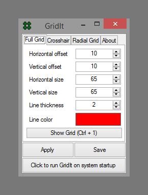

#  GridIt
**Technology:** Windows Forms, WinAPI Interoperability

**Description:** Desktop overlay app. Allows displaying configurable grid over entire desktop area, as well as crosshair following mouse pointer.

**Screens:**

 